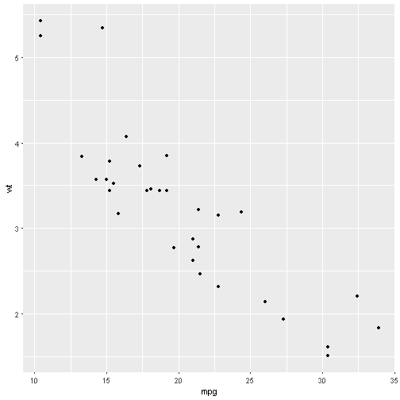
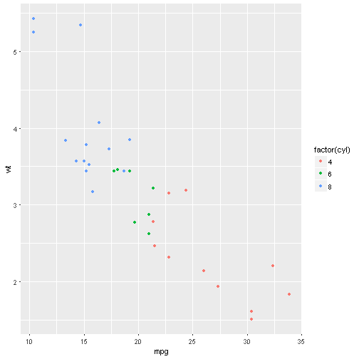
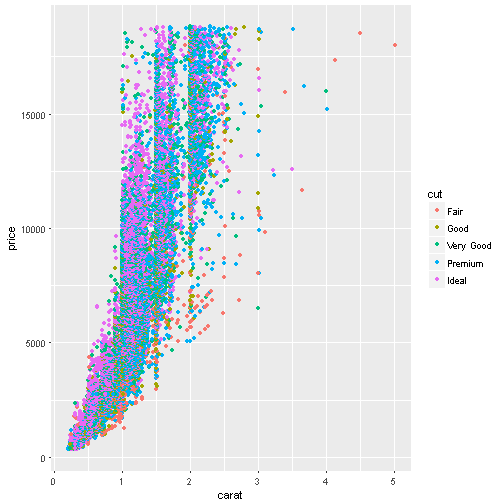
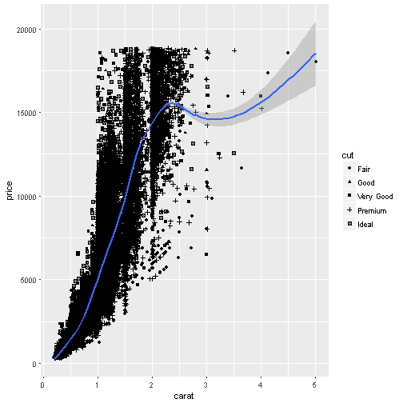
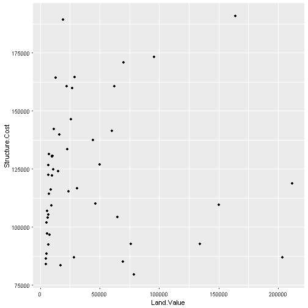
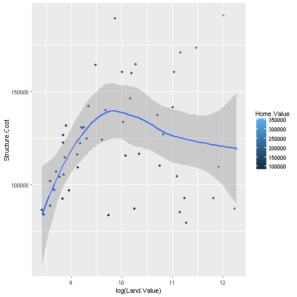
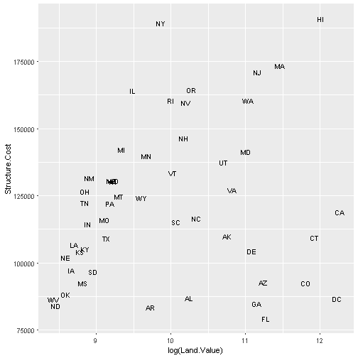
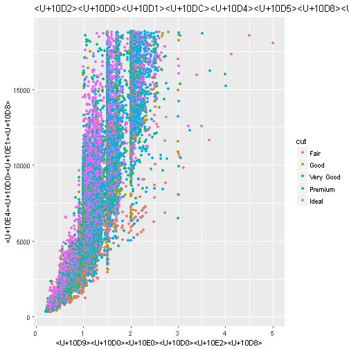

<div class="header" style="margin-top:0 px;font-size:60%;">R-Ladies Tbilisi Introductory Workshop Series</div>

შესავალი მონაცემთა ვიზუალიზაციაში
========================================================
author: დავით სიჭინავა, CRRC-საქართველო | თსუ
date: 24 თებერვალი, 2018
autosize: true
transition: none
css: css/style.css
font-family: 'BPG_upper'


დღევანდელი გეგმა:
========================================================
* (მოკლე) შესავალი მონაცემთა ვიზუალიზაციაში;
* ვიზუალიზაციის ,,ფენოვანი" გრამატიკა;
* `ggplot2` ბიბლიოთეკა;
* პრაქტიკული სამუშაოები;

სანამ დავიწყებდეთ:
========================================================
* დავრწმუნდეთ, რომ ყველა თქვენგანს ჩამოტვირთული აქვს `ggplot2` ბიბლიოთეკა
* მიუთითეთ სამუშაო დირექტორია (კარგი პრაქტიკა)

სანამ დავიწყებდეთ:
========================================================

```r
library(ggplot2)
```

(მოკლე) შესავალი მონაცემთა ვიზუალიზაციაში
========================================================

კარგი დიაგრამა იდეას უნდა გადმოსცემდე:
* გარკვევით,
* ზუსტად,
* ეფექტურად

(მოკლე) შესავალი მონაცემთა ვიზუალიზაციაში
========================================================
* აჩვენეთ მონაცემები,
* ,,აიძულეთ" მაყურებელი, იფიქროს მონაცემებზე,
* ნუ დაამახინჯებთ იმას, თუ რას ამბობს მონაცემები,
* წარმოადგინეთ ბევრი მონაცემი მცირე სივრცეში
* იყავით თანმიმდევრული
* წაახალისეთ მაყურებლის თვალი, ერთმანეთს სხვადასხვა კატეგორია შეადაროს
* წარმოადგინეთ მონაცემთა დეტალების სხვადასხვა დონე
* იფიქრეთ, თუ რა არის დიაგრამის მიზანი: აღწერა, აღმოჩენა, ტაბულაცია თუ - დეკორაცია
* დიაგრამა ტექსტთან ინტეგრირებული უნდა იყოს


(მოკლე) შესავალი მონაცემთა ვიზუალიზაციაში
========================================================

<span style="width: 100%;text-align: center; font-size:10px">წყარო: VDQI</span>


(მოკლე) შესავალი მონაცემთა ვიზუალიზაციაში: 
========================================================
* მონაცემების მიერ დიაგრამაზე დაკავებული ფართობი მათი რაოდენობრივი პროპორციების შესატყვისი უნდა იყოს
* მოიშველიეთ წარწერები, რათა დიაგრამაზე არსებული გაურკვევლობები ახსნათ

(მოკლე) შესავალი მონაცემთა ვიზუალიზაციაში: 
========================================================

<span style="width: 100%;text-align: center; font-size:10px">წყარო: VDQI</span>


(მოკლე) შესავალი მონაცემთა ვიზუალიზაციაში: 
========================================================
* აჩვენეთ მონაცემთა ვარიაცია და არა - დიზაინის ვარიაცია

(მოკლე) შესავალი მონაცემთა ვიზუალიზაციაში: 
========================================================

<span style="width: 100%;text-align: center; font-size:10px">წყარო: VDQI</span>

(მოკლე) შესავალი მონაცემთა ვიზუალიზაციაში: 
========================================================

<span style="width: 100%;text-align: center; font-size:10px">წყარო: VDQI</span>

(მოკლე) შესავალი მონაცემთა ვიზუალიზაციაში: ტაფტის ხუთი მცნება
========================================================
* აჩვენეთ მონაცემები,
* გაზარდეთ მონაცემთა და ,,მელნის" შეფარდება,
* წაშალეთ ის ,,მელანი", რომელიც მონაცემებიდან არ მომდინარეობს,
* წაშალეთ უსარგებლო ,,მელანი", რომელიც მონაცემებიდან მომდინარეობს,
* გაუკეთეთ რედაქტირება თქვენს ნამუშევარს

მონაცემთა ,,ფენოვანი" გრამატიკა
========================================================

<span style="width: 100%;text-align: center; font-size:10px">წყარო: [menu.ge](https://www.menu.ge/restaurant/baraka/fenovani-khachapuri_24049.html)</span>


მონაცემთა ,,ფენოვანი" გრამატიკა (Wilkinson, 2005; Wickham, 2008)
========================================================
* მონაცემები და ,,ესთეტიკა'';
* ობიექტები (,,გეომები'');
* სტატისტიკური ტრანსფორმაცია (,,სტატები'');
* მასშტაბი;
* წახნაგები (,,ფაცეტები'')

მონაცემთა ,,ფენოვანი" გრამატიკა: `ggplot2`
========================================================

```r
p <- ggplot(mtcars)

summary(p)
```

```
data: mpg, cyl, disp, hp, drat, wt, qsec, vs, am, gear, carb
  [32x11]
faceting: <ggproto object: Class FacetNull, Facet>
    compute_layout: function
    draw_back: function
    draw_front: function
    draw_labels: function
    draw_panels: function
    finish_data: function
    init_scales: function
    map: function
    map_data: function
    params: list
    render_back: function
    render_front: function
    render_panels: function
    setup_data: function
    setup_params: function
    shrink: TRUE
    train: function
    train_positions: function
    train_scales: function
    vars: function
    super:  <ggproto object: Class FacetNull, Facet>
```

მონაცემთა ,,ფენოვანი" გრამატიკა: `ggplot2`
========================================================
* რა თქმა უნდა, როგორც ყველაფერი, ისე დიაგრამა `ggplot2` გარემოში ობიექტს წარმოადგენს
* ,,ესთეტიკის'' კარტირება ხდება `aes()` ფუნქციის მეშვეობით.
* ,,ესთეტიკა'' აჩვენებს, თუ რა __ცვლადები__ უნდა იქნას გამოყენებული დიაგრამაში


მონაცემთა ,,ფენოვანი" გრამატიკა: `ggplot2`
========================================================

```r
p <- ggplot(mtcars, aes(x=mpg, y=wt))

p + geom_point()
```



მონაცემთა ,,ფენოვანი" გრამატიკა: `ggplot2`
========================================================

```r
p + geom_point(aes(colour = factor(cyl)))
```


მონაცემთა ,,ფენოვანი" გრამატიკა: `tidy` მონაცემები (Codd, 1990; Wickham, 2010)
========================================================
* თითოეული ცვლადი მოცემულია ცალკე სვეტში,
* თითოეული ჩანაწერი მოცემულია ცალკე რიგში,
* ჩანაწერის თითოეული ტიპი ქმნის ცხრილს,


<span style="width: 100%;text-align: center; font-size:10px">წყარო: Wickham, 2010</span>

მონაცემთა ,,ფენოვანი" გრამატიკა: `tidy` მონაცემები (Codd, 1990; Wickham, 2010)
========================================================

<span style="width: 100%;text-align: center; font-size:10px">წყარო: Wickham, 2010</span>

მონაცემთა ,,ფენოვანი" გრამატიკა: ,,ესთეტიკა''
========================================================
* `position`: პოზიცია,
* `color`: ,,გარეთა ფერი",
* `fill`: ,,შიდა ფერი",
* `shape`: მარკერების ფორმა,
* `linetype`: წრფის ტიპი,
* `size`: ზომა

მონაცემთა ,,ფენოვანი" გრამატიკა: ,,ესთეტიკა""
========================================================

```r
ggplot(diamonds, aes(x=carat, y=price, color=cut)) + geom_point()
```



მონაცემთა ,,ფენოვანი" გრამატიკა: ,,ესთეტიკა""
========================================================

```r
ggplot(diamonds) + geom_point(aes(x=carat, y=price, color=cut))
```


მონაცემთა ,,ფენოვანი" გრამატიკა: ,,ესთეტიკა""
========================================================

```r
ggplot(diamonds, aes(x=carat, y=price)) + geom_point(aes(color=cut)) + geom_smooth()
```


მონაცემთა ,,ფენოვანი" გრამატიკა: ,,ესთეტიკა""
========================================================

```r
ggplot(diamonds, aes(x=carat, y=price)) + geom_point(aes(shape=cut)) + geom_smooth()
```




მონაცემთა ,,ფენოვანი" გრამატიკა: ,,გეომები''
========================================================

```r
### https://goo.gl/Jrr8LQ 

housing <- read.csv("data/landdata-states.csv")

hp2001Q1 <- subset(housing, Date == 2001.25) 

ggplot(hp2001Q1, aes(y = Structure.Cost, x = Land.Value)) + geom_point()
```



მონაცემთა ,,ფენოვანი" გრამატიკა: ,,გეომები''
========================================================

```r
hp2001Q1$pred.SC <- predict(lm(Structure.Cost ~ log(Land.Value), data = hp2001Q1))

p1 <- ggplot(hp2001Q1, aes(x = log(Land.Value), y = Structure.Cost))

p1 + geom_point(aes(color = Home.Value)) + geom_line(aes(y = pred.SC))
```


მონაცემთა ,,ფენოვანი" გრამატიკა: ,,გეომები''
========================================================

```r
p1 + geom_point(aes(color = Home.Value)) + geom_smooth()
```


მონაცემთა ,,ფენოვანი" გრამატიკა: ,,გეომები''
========================================================

```r
p1 + geom_text(aes(label=State), size = 3)
```



მონაცემთა ,,ფენოვანი" გრამატიკა: წარწერები
========================================================

```r
gg <- ggplot(diamonds, aes(x=carat, y=price, color=cut)) + geom_point() + labs(title="გაბნევის დიაგრამა :)", x="კარატი", y="ფასი")

print(gg)
```



მონაცემთა ,,ფენოვანი" გრამატიკა: თემები
========================================================

```r
gg1 <- gg + theme(plot.title=element_text(size=30, face="bold"), 
                  axis.text.x=element_text(size=15), 
                  axis.text.y=element_text(size=15),
                  axis.title.x=element_text(size=25),
                  axis.title.y=element_text(size=25)) + 
  scale_color_discrete(name="ბრილიანტის დამუშავებული ფორმა")
print(gg1)  # print the plot
```


მონაცემთა ,,ფენოვანი" გრამატიკა: ,,წახნაგები''
========================================================

```r
gg1 + facet_wrap( ~ cut, ncol=3)
```


მონაცემთა ,,ფენოვანი" გრამატიკა: ,,წახნაგები''
========================================================

```r
gg1 + facet_wrap( ~ cut, ncol=3)
```


პრაქტიკული სამუშაო
========================================================


```r
### მონაცემები: https://goo.gl/CuGtsx
```
სასარგებლო რესურსები:
========================================================
* `ggplot2` [,,შპარგალკა''](https://www.rstudio.com/wp-content/uploads/2015/03/ggplot2-cheatsheet.pdf)
* [ggplot2: Elegant Graphics for Data Analysis](https://www.amazon.com/ggplot2-Elegant-Graphics-Data-Analysis/dp/331924275X/ref=sr_1_1?s=books&ie=UTF8&qid=1506225102&sr=1-1&keywords=ggplot2)
* [ოფიციალური გვერდი](http://ggplot2.tidyverse.org/index.html)
* რა თქმა უნდა, [Stack Overflow](https://stackoverflow.com/questions/tagged/ggplot2)


გამოყენებული რესურსები:
========================================================
Selva Prabhakaran: [How to make any plot in ggplot2?](http://r-statistics.co/ggplot2-Tutorial-With-R.html)
Ista Zahn: [R graphics workshop @ Harvard](http://tutorials.iq.harvard.edu/R/Rgraphics/Rgraphics.html)

გმადლობთ!
========================================================
 david@sichinava.ge

 davidsichinava

 @davidsichinava
