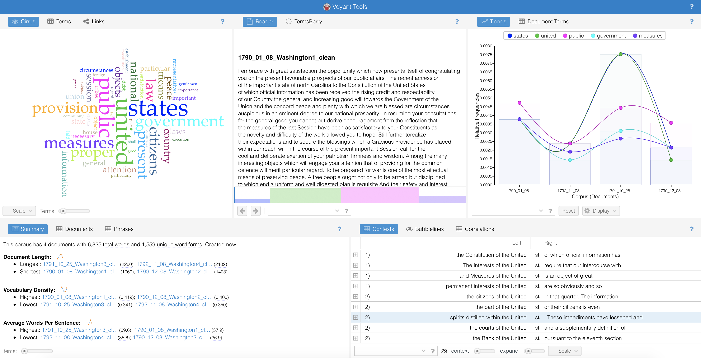
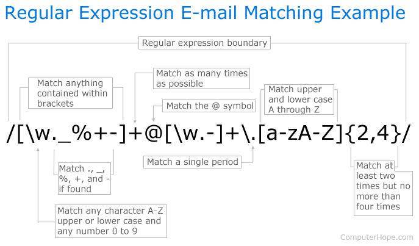

```{r setup, include=FALSE}
options(htmltools.dir.version = FALSE)

hook_source <- knitr::knit_hooks$get('source')
knitr::knit_hooks$set(source = function(x, options) {
  x <- stringr::str_replace(x, "^[[:blank:]]?([^*].+?)[[:blank:]]*#<<[[:blank:]]*$", "*\\1")
  hook_source(x, options)
})
```

# About me 

- Studying for a PhD in Statistics at the University of Warwick

- Previous degrees in Mathematics and Philosophy, History and Philosophy of Science, Mathematics Education, Secondary School Mathematics teaching

---

# Me and R

- Getting into R:

  - 2014: first R course
  - 2015: first taste of `ggplot2` 
  - 2016: first R package 
  - 2017: first community involvement (useR!2017, [Oxford R User Group](https://r-oxford.github.io), [rainbowR](https://rainbowr.slack.com), [@R_LGBTQ](https://twitter.com/R_LGBTQ))
  - 2020: first [TidyTuesday](https://github.com/rfordatascience/tidytuesday) contribution
  - 2021: first ...
  
---

class: center, inverse
background-image: url("edX_digital_humanities.png")
background-position: center
background-size: contain

---

class: center, inverse
background-image: url("Washington-and-Jefferson.jpg")
background-position: center
background-size: contain

---

# Command line

**Research question**: lengths of sentences in presidential speeches over the course of a presidency: terse and to the point at the beginning, long windered towards the end? Do they stay the same?

- Take word counts of each sentence and calculate the average word count per sentence per speech.

- Want table with year, month and sentence length recorded for each presidential speech. 

---

# [https://voyant-tools.org](https://voyant-tools.org)




---

# Libraries

```{r message = FALSE, warning = FALSE}
library(tidyverse) # especially `stringr`, `ggplot2`
library(RVerbalExpressions)
library(tidytext)
library(wordcloud)
library(ggwordcloud)
library(tidygraph)
library(ggraph)
```

---

# Inputting the text

```{r}
text <- read_file("1790_01_08_Washington1.txt")
```

--

(show this)
---

# Regular expressions 

A sequence of characters that defines a search pattern.

--

.e$

--

```{r}
fruit <- c("apple", "orange", "pear")
str_view(fruit, ".e$")
```

---

# Basic `stringr`

```{r}
fruit <- c("apple", "orange", "pear")
str_detect(fruit, ".e$")
str_extract(fruit, ".e$")
str_subset(fruit, ".e$")
```


---



See [discussion](https://stackoverflow.com/questions/201323/how-to-validate-an-email-address-using-a-regular-expression/201378#201378)

---

# `RVerbalExpressions`

[https://github.com/VerbalExpressions/RVerbalExpressions](https://github.com/VerbalExpressions/RVerbalExpressions)


```{r}
span_rx <- rx() %>%
  rx_find("<") %>%
  rx_anything_but(">") %>%
  rx_find(">")

span_rx
```

--

## Other Regular Expressions resources in R

- [rex](https://github.com/kevinushey/rex)
- [RegExplain](https://github.com/gadenbuie/regexplain)

---

# Cleaning the text

```{r clean-one-text}
text_clean <- text %>%
  str_remove_all(span_rx) %>% # remove html tags #<<
  str_remove_all("\\\\xe2\\\\x80\\\\x94") %>% # remove unicode
  str_replace_all("&#32", " ") %>% # replace html space with space
  str_squish() %>% # remove excess white space #<<
  str_replace_all("-", " ") %>% # remove hyphens (pros and cons)
  str_remove_all("[^[:alnum:][:space:].]") %>% # remove punctuation except "."
  str_remove("This work is in the.*") # remove final sentence

write_file(text_clean, "1790_01_08_Washington1_clean.txt")
```

--

## `stringr` resources

- [`stringr` package site](https://stringr.tidyverse.org)
- [cheatsheet](https://resources.rstudio.com/rstudio-cheatsheets/stringr-cheat-sheet)
- [Strings chapter in R for Data Science](https://r4ds.had.co.nz/strings.html)

---

# Tidy Text

- The tidy text format is a table with one-token-per-row. 
- A token is a meaningful unit of text, such as a word, that we are interested in using for analysis
- Tokenization is the process of splitting text into tokens. 

When text is stored in this way, we can manipulate and plot it with other tidy tools, such as `dplyr`, `tidyr` and `ggplot2`.

--

The tidy text approach was developed by [Julia Silge](https://juliasilge.com) and [David Robinson](http://varianceexplained.org).

The main reference is the book [Text Mining with R: A tidy approach](https://www.tidytextmining.com). 

Tools for this approach are provided in the [`tidytext`](https://juliasilge.github.io/tidytext/) package.

---

# Tokenizing the Washington speech

```{r tidytext-one-text}
text_df <- tibble(speech = text_clean) %>%
  unnest_tokens(sentence, speech, token = "sentences") #<<

text_df
```

---

# Get sentence lengths
```{r sentence-length-one-text}
text_df %>%
  mutate(sentence_length = str_count(sentence, boundary("word"))) %>%
  summarise(mean_sentence_length = mean(sentence_length))
```

---

# Working with multiple text files

```{r}
washington_speeches <- tibble(speech_name = c("1790_01_08_Washington1.txt",
                                              "1790_12_08_Washington2.txt",
                                              "1791_10_25_Washington3.txt",
                                              "1792_11_08_Washington4.txt"))

washington_speeches_df <- washington_speeches %>%
  mutate(speech = purrr::map_chr(speech_name, ~read_file(.x))) %>% #<<
  mutate(speech = str_remove_all(speech, span_rx)) %>% # remove html tags
  mutate(speech = str_remove_all(speech, "\\\\xe2\\\\x80\\\\x94")) %>% 
  mutate(speech = str_remove_all(speech, "&#32")) %>% # replace spaces
  mutate(speech = str_squish(speech)) %>% # remove excess white space
  mutate(speech = str_replace_all(speech, "-", " ")) %>% # remove hyphens 
  mutate(speech = str_remove_all(speech, "[^[:alnum:][:space:].]")) %>%
  mutate(speech = str_remove(speech, "This work is in the.*")) %>%
  mutate(speech_name = str_remove(speech_name, "[:digit:]\\.txt"))
```

---

# Split into sentences...

```{r}
washington_speeches_df %>%
  unnest_tokens(sentence, speech, token = "sentences")
```

---

# ...and get average sentence length

```{r message = FALSE}
washington_speeches_summary <- washington_speeches_df %>%
  unnest_tokens(sentence, speech, token = "sentences") %>%
  mutate(sentence_length = str_count(sentence, boundary("word"))) %>%
  group_by(speech_name) %>% #<<
  summarise(mean_sentence_length = mean(sentence_length)) %>%
  separate(speech_name, sep = "_", into = c("Year", "Month", "Day", "President")) 

washington_speeches_summary
```

--

```{r echo = FALSE, message = FALSE}
jefferson_speeches <- tibble(speech_name = c("1801_12_08_Jefferson1.txt", "1802_12_15_Jefferson2.txt", "1803_10_17_Jefferson3.txt", "1804_11_08_Jefferson4.txt"))

jefferson_speeches_df <- jefferson_speeches %>%
  mutate(speech = map_chr(speech_name, ~read_file(.x))) %>%
  mutate(speech = str_remove_all(speech, "<[^>]*>")) %>% # remove html
  mutate(speech = str_remove_all(speech, "\\\\xe2\\\\x80\\\\x94")) %>% # remove unicode
  mutate(speech = str_replace_all(speech, "&#32", " ")) %>% # remove unicode
  mutate(speech = str_squish(speech)) %>% # remove excess white space
  mutate(speech = str_replace_all(speech, "-", " ")) %>% # remove hyphens (pros and cons)
  mutate(speech = str_remove_all(speech, "[^[:alnum:][:space:].]")) %>%
  mutate(speech = str_remove(speech, "This work is in the.*")) %>%
  mutate(speech_name = str_remove(speech_name, "[:digit:]\\.txt"))

jefferson_speeches_summary <- jefferson_speeches_df %>%
  unnest_tokens(sentence, speech, token = "sentences") %>%
  mutate(sentence_length = str_count(sentence, boundary("word"))) %>%
  group_by(speech_name) %>%
  summarise(mean_sentence_length = mean(sentence_length)) %>%
  separate(speech_name, sep = "_", into = c("Year", "Month", "Day", "President"))

jefferson_speeches_summary
```

---

# Word counts

```{r}
washington_by_word <- washington_speeches_df %>%
  unnest_tokens(word, speech, token = "words") #<<
```

--

```{r}
washington_by_word %>%
  count(word, sort = TRUE)
```

---

# Stop words

```{r}
data(stop_words) # contained in `tidytext`

washington_words <- washington_by_word %>%
  anti_join(stop_words, by = "word") #<<

washington_count <- washington_words %>%
  count(word, sort = TRUE)

washington_count
```

---

class: center, middle


---

# What's missing?

```{r}
head(washington_count)
```

--

```{r}
stop_words %>%
  filter(word == "states")
```

---

# Try again...

```{r}
stop_words_modified <- stop_words %>%
  filter(word != "states")

washington_words <- washington_by_word %>%
  anti_join(stop_words_modified, by = "word")

washington_count <- washington_words %>%
  count(word, sort = TRUE)

washington_count
```

---

# Visualising as bar chart

.pull-left[
```{r plot-label, eval=FALSE}
washington_count %>%
  filter(n > 9) %>%
  mutate(word = reorder(word, n)) %>%
  ggplot(aes(y = word, x = n)) + 
  geom_col() + 
  ylab(NULL) 
```
]

.pull-right[
```{r plot-label-out, ref.label="plot-label", echo=FALSE}
```
]

---

# Visualising as `wordcloud`

```{r wordcloud, eval = FALSE}
set.seed(2)
wordcloud(words = washington_count$word, freq = washington_count$n, 
          min.freq = 9, rot.per = 0.35, colors = brewer.pal(8, "YlGnBu"))
```

---

class: center, middle

```{r wordcloud-out, ref.label="wordcloud", echo=FALSE, fig.width=10}
```

---

# Visualising as `ggwordcloud`

```{r ggwordcloud, eval = FALSE}
set.seed(2)
washington_count %>%
  filter(n >= 9) %>%
  mutate(angle = 90 * sample(c(0, 1), n(), replace = TRUE, prob = c(63, 35))) %>%
  ggplot(aes(label = word, size = n, colour = n, angle = angle)) +
    geom_text_wordcloud() + #<<
    scale_radius(range = c(0, 15), limits = c(0, NA)) +
    theme_minimal() +
    scale_color_viridis_c(direction = -1, end = 0.9, begin = 0.1)
```

[`ggwordcloud` vignette](https://cran.r-project.org/web/packages/ggwordcloud/vignettes/ggwordcloud.html)
---

class: center, middle

```{r ggwordcloud-out, ref.label="ggwordcloud", echo=FALSE, fig.width=10}
```

---

class: center, middle


---

# Bigrams

```{r}
washington_bigrams <- washington_speeches_df %>%
  unnest_tokens(bigram, speech, token = "ngrams", n = 2) #<<

washington_bigrams
```

---

# Separate out and remove stop words

```{r}
washington_bigrams <- washington_bigrams %>%
  separate(bigram, c("word1", "word2"), sep = " ") %>%
  filter(!word1 %in% stop_words_modified$word) %>%
  filter(!word2 %in% stop_words_modified$word) 
```

```{r}
washington_bigram_counts <- washington_bigrams %>%
  count(word1, word2, sort = TRUE)

washington_bigram_counts
```

---

# Create a graph

```{r}
washington_bigram_graph <- washington_bigram_counts %>%
  filter(n > 1) %>%
  as_tbl_graph() #<<
```

---

# The graph object

```{r}
washington_bigram_graph
```

---

# Plot the graph

```{r first-graph, eval = FALSE}
set.seed(1)
ggraph(washington_bigram_graph, layout = "fr") + #<<
  geom_edge_link() +
  geom_node_point() +
  geom_node_text(aes(label = name), vjust = 1, hjust = 1, repel = TRUE)
```

---

class: center, middle

```{r first-graph-out, ref.label="first-graph", echo=FALSE}
```

---

# Improve the graph


```{r second-graph, eval = FALSE}
set.seed(1)

a <- grid::arrow(type = "closed", length = unit(.1, "inches"))

ggraph(washington_bigram_graph, layout = "fr") +
  geom_edge_link(aes(edge_alpha = n), show.legend = FALSE, arrow = a, #<<
                 end_cap = circle(.07, 'inches')) + #<<
  geom_node_point(color = "lightblue", size = 5) +
  geom_node_text(aes(label = name), vjust = 1, hjust = 1, repel = TRUE) +
  theme_void()
```

---

class: center, middle

```{r second-graph-out, ref.label="second-graph", echo=FALSE}
```

---

## Compare word frequencies in two sets of texts

```{r echo = FALSE}
jefferson_words <- jefferson_speeches_df %>%
  unnest_tokens(word, speech, token = "words") %>%
  anti_join(stop_words_modified, by = "word")
```


```{r}
frequency <- bind_rows(washington_words, jefferson_words) %>%
  mutate(speech_name = str_extract_all(speech_name, "Washington|Jefferson", 
                                       simplify = TRUE)) %>%
  rename(president = speech_name) %>%
  count(president, word) %>%
  group_by(president) %>%
  mutate(proportion = n/sum(n)) %>%
  select(-n) %>%
  pivot_wider(names_from = "president", values_from = "proportion") 
```

--

```{r}
set.seed(234)
slice_sample(frequency, n = 6) # dplyr 1.0.0 #<<
```


---

# Plot

```{r frequency-plot, eval = FALSE}
ggplot(frequency, aes(x = Washington, y = Jefferson, 
                      color = abs(Washington - Jefferson))) +
  geom_abline(color = "gray40", lty = 2) +
  geom_jitter(alpha = 0.1, size = 2.5, width = 0.3, height = 0.3) +
  geom_text(aes(label = word), check_overlap = TRUE, vjust = 1.5) +
  scale_x_log10(labels = scales::percent_format()) +
  scale_y_log10(labels = scales::percent_format()) +
  scale_color_gradient(limits = c(0, 0.001), 
                       low = "darkslategray4", high = "gray75") +
  theme(legend.position="none") 
```

---

class: center, middle


```{r frequency-plot-out, ref.label="frequency-plot", echo=FALSE, warning = FALSE}
```

---

class: center, middle


---

# Sentiment: AFINN

Score -5 (most negative) to 5 (most positive)

```{r}
get_sentiments("afinn") 
```

---

# Sentiment: bing

binary positive/negative

```{r}
get_sentiments("bing") 
```

---

# Sentiment: nrc

categorizes words in a binary fashion (“yes”/“no”) into categories of positive, negative, anger, anticipation, disgust, fear, joy, sadness, surprise, and trust

```{r}
get_sentiments("nrc") 
```

---

# Notes on sentiments

- Note that all these lexicons are on unigrams, so don't pick up things like 'no good' as negative

--

- Constructed via either crowdsourcing (using, for example, Amazon Mechanical Turk) or by the labor of one of the authors

--

- Validated using some combination of crowdsourcing again, restaurant or movie reviews, or Twitter data

--

- Be hesitant about applying these sentiment lexicons to styles of text dramatically different from what they were validated on, such as presidential speeches from 230 years ago!

--

- There are some other domain-specific sentiment lexicons available, constructed to be used with text from a specific content area


---

# Washington sentiment: code

```{r wash-sent, eval = FALSE}
washington_words %>%
  inner_join(get_sentiments("bing"), by = "word") %>% #<<
  count(word, sentiment, sort = TRUE) %>%
  ungroup() %>%
  group_by(sentiment) %>%
  slice_max(order_by = n, n = 5) %>% # dplyr 1.0.0 #<<
  ungroup() %>%
  mutate(word = reorder(word, n)) %>%
  ggplot(aes(y = word, x = n, fill = sentiment)) + # ggplot2 3.3.0 #<<
    geom_col(show.legend = FALSE) +
    facet_wrap(~sentiment, scales = "free_y") +
    labs(x = "Contribution to sentiment",
       y = NULL) 
```

---

# Washington sentiment: plot

```{r wash-sent-out, ref.label="wash-sent", echo=FALSE, fig.align="center", fig.width=10}
```

---

class: center

background-image: url("pride-prej-sent.png")
background-position: center
background-size: contain

---

class: center

background-image: url("2020_19_AnimalCrossing_alt_50.png")
background-position: center
background-size: contain

---

# Some other resources 

- [Code for graph on previous slide](https://github.com/Z3tt/TidyTuesday/blob/master/R/2020_19_AnimalCrossing.Rmd)
- [readtext.quanteda.io](https://readtext.quanteda.io) - import and handling for plain and formatted text files
- [pdftools](https://docs.ropensci.org/pdftools/) - extracting text and metadata from pdf files in R
- [tesseract](https://cran.r-project.org/web/packages/tesseract/vignettes/intro.html) - optical character recognition in R
- [quantedo.io](http://quanteda.io) - managing and analyzing texts; apply natural language processing to texts

[@rivaquiroga](https://twitter.com/rivaquiroga) (via [@WeAreRLadies](https://twitter.com/WeAreRLadies))

---
class: center, middle, inverse

## Please ask me questions!


## I'd love to hear from you:
[E.Kaye.1@warwick.ac.uk](mailto:E.Kaye.1@warwick.ac.uk)

[@ellamkaye](https://twitter.com/ellamkaye)

[ellakaye.rbind.io](https://ellakaye.rbind.io)

[github.com/EllaKaye](https://github.com/ellakaye)
